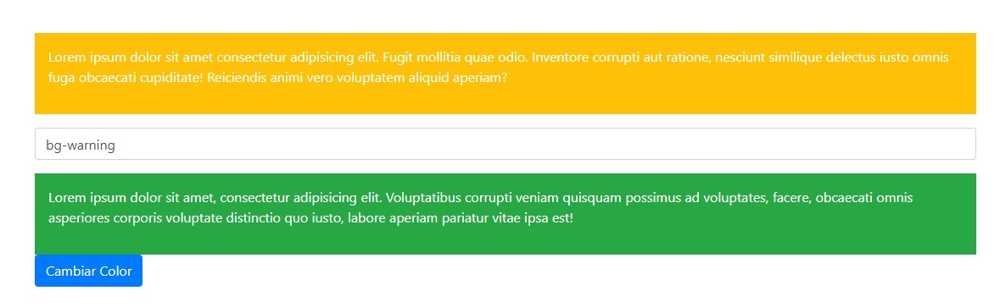

## Vue JS - Ejemplo 2

### Introducción
- Presentación al curso Vue - Vuex - VueRouter - Firebase
–
### [VUE JS] Fundamentos
- Instalar Vue js con CDN
- V-model
- Keyup, v-model y Computed
- **Clases (v-bind:class)**
- Propiedades Computadas (computed)
- Ciclo de vida de Vue (Lifecycle)
- Componentes básicos
- Comunicación entre componentes (parte 1)
- Comunicación entre componentes (parte 2)
